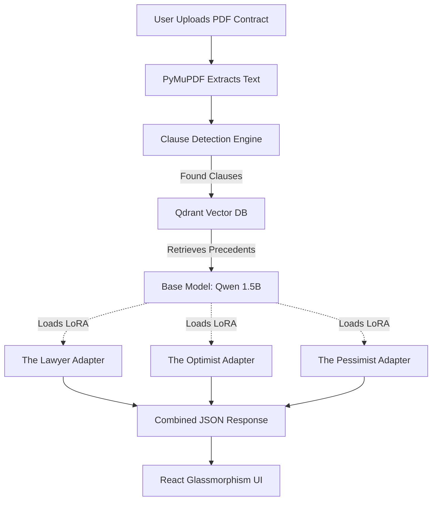

# ⚖️ AI Devil's Advocate

**AI Devil's Advocate** is an advanced legal tech application that analyzes contract clauses through three distinct, fine-tuned AI personas: **The Lawyer**, **The Optimist**, and **The Pessimist**. 

Built to showcase an end-to-end Local LLM workflow, the application features an entirely local RAG (Retrieval-Augmented Generation) pipeline backed by a vector database, and uses dynamic LoRA (Low-Rank Adaptation) adapters hot-swapped at runtime to change the AI's personality and risk-analysis style.

---

## 🎯 The Problem & The Solution
Legal contracts are notoriously difficult to read, and missing a single clause can result in catastrophic financial or legal exposure. Standard AI models provide generic summaries that often miss the nuance of legal risk.

**The Solution:** We fine-tuned a base AI model (`Qwen/Qwen2.5-1.5B-Instruct`) into three highly specialized experts using the **CUAD (Contract Understanding Atticus Dataset)**. By hot-swapping these lightweight adapters into memory, the application processes a single contract through three different "brains" simultaneously:
- 🏛️ **The Lawyer:** Identifies structural risks, loopholes, and strict legal liabilities.
- 🤝 **The Optimist:** Reframes clauses to highlight best-case outcomes and mutual benefits.
- 🚨 **The Pessimist:** Warns of worst-case scenarios, catastrophic failures, and unbounded exposure.

---

## 🛠️ Tech Stack & AI Models

### Artificial Intelligence & Machine Learning
- **Base Model:** `Qwen/Qwen2.5-1.5B-Instruct` (A highly capable, lightweight 1.5B parameter model).
- **Fine-Tuning Architecture:** `peft` (Parameter-Efficient Fine-Tuning) and `trl` using **LoRA**.
- **Training Dataset:** The **CUAD (Contract Understanding Atticus Dataset)**, enhanced with synthetic persona-driven instruction pairs.
- **RAG Pipeline Embeddings:** `all-MiniLM-L6-v2` via `Sentence-Transformers`.
- **Hardware:** Runs 100% locally on consumer GPUs.

### Backend
- **FastAPI:** High-performance async Python backend.
- **Qdrant:** Local Vector Database for the Retrieval-Augmented Generation (RAG) pipeline to pull in relevant legal precedents.
- **PyMuPDF (fitz):** For robust local PDF text extraction.

### Frontend
- **React.js & Vite:** Lightning-fast, component-based UI.
- **Vanilla CSS:** Custom, modern, glassmorphic UI design with responsive grids and CSS animations (No component libraries used).

---

## 🧠 System Architecture



---

## 🎓 How It Was Trained (The Data Pipeline)
To create these distinct personas without destroying the model's base legal knowledge, we used a highly specialized pipeline:
1. **Dataset Acquisition:** We utilized the `cuad-main` dataset (Contract Understanding Atticus Dataset), which contains thousands of real-world legal clauses annotated by legal experts.
2. **Synthetic Data Generation:** We ran the raw CUAD clauses through a prompt-generation pipeline to create three distinct outputs for each clause (Lawyer, Optimist, Pessimist).
3. **LoRA Fine-Tuning:** Instead of training three separate 1.5B parameter models (which would destroy VRAM), we froze the base model weights and trained three separate **LoRA adapters**. 
4. **Dynamic Hot-Swapping:** At runtime, the FastAPI backend uses `set_adapter()` to instantly swap the active persona weights on the base model in milliseconds.

---

## 🚀 Setup & Installation

Follow these steps exactly to run the project locally on your machine.

### 1. Prerequisites
- Python 3.10 or higher
- Node.js 18 or higher
- A GPU with at least 8GB VRAM (Highly Recommended)

### 2. Clone the Repository
```bash
git clone https://github.com/Pranav-2006-28/Ai-Devils-Advocate.git
cd Ai-Devils-Advocate
```

### 3. Backend Setup (FastAPI & AI Models)
Open a terminal and navigate to the `backend` folder:
```bash
cd backend
python -m venv venv

# Activate Virtual Environment (Windows)
.\venv\Scripts\activate
# Activate Virtual Environment (Mac/Linux)
source venv/bin/activate

# Install dependencies
pip install -r requirements.txt
pip install PyMuPDF
```

### 4. Frontend Setup (React & Vite)
Open a **second, separate terminal** and navigate to the `frontend` folder:
```bash
cd frontend
npm install
```

---

## 🏃‍♂️ Running the Application

> [!WARNING]
> **First Run / Server Startup:** The very first time you start the backend server, it will take **5-6 minutes to load**. This is completely normal! The server is downloading the Qwen 1.5B parameter base model (if not cached) and loading the LoRA adapters into your GPU/CPU memory. Once loaded, it runs lightning fast.

You will need your two terminals running simultaneously.

**Terminal 1: Start the Backend**
```bash
cd backend
.\venv\Scripts\activate
python -m uvicorn app.main:app --reload --port 8001
```

**Terminal 2: Start the Frontend**
```bash
cd frontend
npm run dev
```

Finally, open your browser and go to `http://localhost:5173`. Drop a PDF contract into the upload zone and watch the AI analyze the risk!

---

## 📄 License
This project is licensed under the MIT License.

*Disclaimer: AI Devil's Advocate is an experimental tool and does not provide actual legal advice. Always consult with a qualified attorney.*
