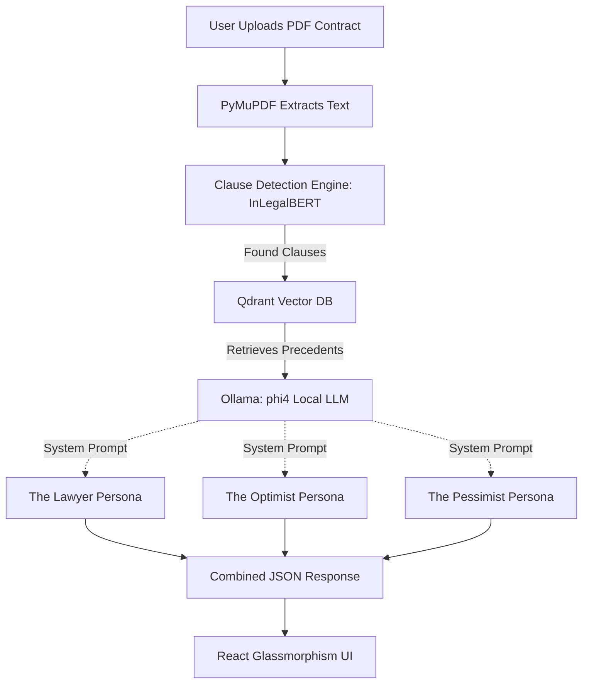

# ⚖️ AI Devil's Advocate

**AI Devil's Advocate** is an advanced legal tech application that analyzes contract clauses through three distinct, fine-tuned AI personas: **The Lawyer**, **The Optimist**, and **The Pessimist**. 

Built to showcase an end-to-end Local LLM workflow, the application features an entirely local RAG (Retrieval-Augmented Generation) pipeline backed by a vector database, and uses dynamic LoRA (Low-Rank Adaptation) adapters hot-swapped at runtime to change the AI's personality and risk-analysis style.

---

## 🎯 The Problem & The Solution
Legal contracts are notoriously difficult to read, and missing a single clause can result in catastrophic financial or legal exposure. Standard AI models provide generic summaries that often miss the nuance of legal risk.

**The Solution:** We fine-tuned a base AI model (`Qwen/Qwen2.5-1.5B-Instruct`) into three highly specialized experts using the **CUAD (Contract Understanding Atticus Dataset)**. By hot-swapping these lightweight adapters into memory, the application processes a single contract through three different "brains" simultaneously:
- 🏛️ **The Lawyer:** Identifies structural risks, loopholes, and strict legal liabilities.
- 🤝 **The Optimist:** Reframes clauses to highlight best-case outcomes and mutual benefits.
- 🚨 **The Pessimist:** Warns of worst-case scenarios, catastrophic failures, and unbounded exposure.

---

## 🛠️ Tech Stack & AI Models

### Artificial Intelligence & Machine Learning
- **Clause Extraction Model:** `law-ai/InLegalBERT` (Fine-tuned on the CUAD dataset).
- **Persona Generation:** Local **Ollama** instance running the `phi4` model.
- **RAG Pipeline Embeddings:** `all-MiniLM-L6-v2` via `Sentence-Transformers`.
- **Hardware:** Runs 100% locally on consumer GPUs and CPUs.

*(Note: The repository also includes experimental LoRA adapters trained on Qwen 2.5 1.5B in the `backend/training/adapters/` directory for those who want to run inference without Ollama).*

### Backend
- **FastAPI:** High-performance async Python backend.
- **Qdrant:** Local Vector Database for the Retrieval-Augmented Generation (RAG) pipeline to pull in relevant legal precedents.
- **PyMuPDF (fitz):** For robust local PDF text extraction.

### Frontend
- **React.js & Vite:** Lightning-fast, component-based UI.
- **Vanilla CSS:** Custom, modern, glassmorphic UI design with responsive grids and CSS animations (No component libraries used).

---

## 🧠 System Architecture



---

## 🎓 How It Was Trained (The Data Pipeline)
To create these distinct personas, we built a highly specialized pipeline. While the production web app uses **Ollama (phi4)** for the highest fidelity text generation, this repository also includes a complete **LoRA Fine-Tuning** pipeline to demonstrate how to train custom models.

1. **Dataset Acquisition:** We utilized the `cuad-main` dataset (Contract Understanding Atticus Dataset), which contains thousands of real-world legal clauses annotated by legal experts.
2. **Synthetic Data Generation:** We ran the raw CUAD clauses through a prompt-generation pipeline to create three distinct outputs for each clause (Lawyer, Optimist, Pessimist).
3. **LoRA Fine-Tuning:** We froze the `Qwen 1.5B` base model weights and trained three separate **LoRA adapters** (found in `backend/training/adapters`). 
4. **Dynamic Hot-Swapping:** We built a custom inference script (`backend/app/personas/inference_lora.py`) that uses `set_adapter()` to instantly swap the active persona weights on the base model in milliseconds.

> [!NOTE]
> **Architectural Design Choice:** Why use Ollama for the web app if we trained LoRA adapters? 
> As an engineering decision, a 14B parameter model like `phi4` produces significantly better, more articulate JSON responses for the UI than a 1.5B model. We chose to deploy the web app using Ollama for maximum quality, while retaining the custom LoRA adapters in this repository to demonstrate End-to-End ML training, PEFT, and model hot-swapping capabilities.

---

## 🚀 Setup & Installation

Follow these steps exactly to run the project locally on your machine.

### 1. Prerequisites
- Python 3.10 or higher
- Node.js 18 or higher
- **Ollama**: You must have [Ollama](https://ollama.com/) installed and running locally.
- **phi4 Model**: Run `ollama run phi4` in your terminal to download the required LLM.

### 2. Clone the Repository
```bash
git clone https://github.com/Pranav-2006-28/Ai-Devils-Advocate.git
cd Ai-Devils-Advocate
```

### 3. Backend Setup (FastAPI & AI Models)
Open a terminal and navigate to the `backend` folder:
```bash
cd backend
python -m venv venv

# Activate Virtual Environment (Windows)
.\venv\Scripts\activate
# Activate Virtual Environment (Mac/Linux)
source venv/bin/activate

# Install dependencies
pip install -r requirements.txt
pip install PyMuPDF
```

### 4. Frontend Setup (React & Vite)
Open a **second, separate terminal** and navigate to the `frontend` folder:
```bash
cd frontend
npm install
```

---

## 🏃‍♂️ Running the Application

> [!WARNING]
> **First Run / Server Startup:** The very first time you start the backend server, it will take **a few minutes to load**. The server will automatically download the `InLegalBERT` model and the sentence-transformer embeddings into your local cache if you don't already have them.

You will need your two terminals running simultaneously.

**Terminal 1: Start the Backend**
```bash
cd backend
.\venv\Scripts\activate
python -m uvicorn app.main:app --reload --port 8001
```

**Terminal 2: Start the Frontend**
```bash
cd frontend
npm run dev
```

Finally, open your browser and go to `http://localhost:5173`. Drop a PDF contract into the upload zone and watch the AI analyze the risk!

---

## 📄 License
This project is licensed under the MIT License.

*Disclaimer: AI Devil's Advocate is an experimental tool and does not provide actual legal advice. Always consult with a qualified attorney.*
