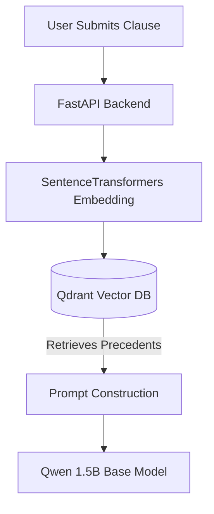
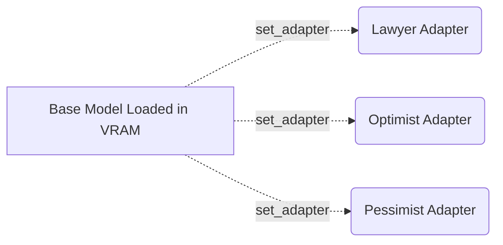

# ⚖️ AI Devil's Advocate

**AI Devil's Advocate** is an advanced legal tech application that analyzes contract clauses through three distinct, fine-tuned AI personas: **The Lawyer**, **The Optimist**, and **The Pessimist**. 

Built to showcase an end-to-end Local LLM workflow, the application features an entirely local RAG (Retrieval-Augmented Generation) pipeline backed by a vector database, and uses dynamic LoRA (Low-Rank Adaptation) adapters hot-swapped at runtime to change the AI's personality and risk-analysis style.


---

## 🚀 Features

- **Multi-Persona Analysis:** Submit a legal clause and get three unique perspectives simultaneously.
  - 🏛️ **The Lawyer:** Identifies structural risks, loopholes, and strict legal liabilities.
  - 🤝 **The Optimist:** Reframes clauses to highlight best-case outcomes and mutual benefits.
  - 🚨 **The Pessimist:** Warns of worst-case scenarios, catastrophic failures, and unbounded exposure.
- **Local RAG Pipeline:** Contextualizes analysis using real-world legal precedents and case law stored in a local Qdrant vector database.
- **Dynamic LoRA Hot-Swapping:** Uses `peft` and HuggingFace `transformers` to dynamically swap LoRA adapters on a base 1.5B parameter model (Qwen 2.5) during inference, achieving distinct personas without loading three massive models into VRAM.
- **100% Local Inference:** No OpenAI API keys. Total data privacy. Runs entirely on consumer GPU hardware.

---

## 🛠️ Tech Stack

### Frontend
- **React.js & Vite:** Lightning-fast, component-based UI.
- **Vanilla CSS:** Custom, modern, glassmorphic UI design with responsive grids and CSS animations.

### Backend
- **FastAPI:** High-performance async Python backend.
- **Qdrant:** Local Vector Database for the Retrieval-Augmented Generation (RAG) pipeline.
- **Sentence-Transformers:** Local embedding generation (`all-MiniLM-L6-v2`).

### AI / Machine Learning
- **Base Model:** `Qwen/Qwen2.5-1.5B-Instruct`
- **Fine-Tuning:** Instruction Fine-Tuning (IFT) using **QLoRA** (`bitsandbytes`, `peft`, `trl`).
- **Data Pipeline:** Synthetic dataset generation based on the CUAD (Contract Understanding Atticus Dataset) taxonomy.

---

## ⚙️ Local Setup & Installation

This project requires a CUDA-compatible NVIDIA GPU for optimal performance, though it can fall back to CPU for inference.

### 1. Clone the Repository
```bash
git clone https://github.com/yourusername/ai-devils-advocate.git
cd ai-devils-advocate
```

### 2. Setup the Python Backend
```bash
cd backend
python -m venv venv
# Windows
venv\Scripts\activate
# Linux/Mac
source venv/bin/activate

pip install -r requirements.txt
```

### 3. Setup the React Frontend
```bash
cd ../frontend
npm install
```

### 4. Build the RAG Knowledge Base
```bash
# From the backend directory
python app/rag/build_index.py
```

### 5. Train the LoRA Personas (Optional)
If you want to train the adapters yourself from the provided dataset, you will need the CUAD data.
*Note: The `cuad-main` folder (containing the Contract Understanding Atticus Dataset) is placed alongside or inside the project directory and is referenced by the training script to generate our specialized datasets.*
```bash
# From the backend directory
python training/train_personas.py
```

---

## 🏃‍♂️ Running the Application

> [!WARNING]
> **First Run / Server Startup:** The very first time you start the backend server, it will take **5-6 minutes to load**. This is completely normal! The server is loading the Qwen 1.5B parameter base model and the LoRA adapters into your GPU/CPU memory. Once loaded, it runs lightning fast.

You will need two terminals running simultaneously.

**Terminal 1: Start the Backend (FastAPI)**
```bash
cd backend
venv\Scripts\activate
python -m uvicorn app.main:app --reload --port 8001
```

**Terminal 2: Start the Frontend (Vite)**
```bash
cd frontend
npm run dev
```

Navigate to `http://localhost:5173` in your browser.

---

## 🧠 Architecture Deep Dive

### 1. The RAG Pipeline
When a user submits a clause, it is first embedded using a local `SentenceTransformer` model. We perform a similarity search against a local **Qdrant** database pre-loaded with legal precedents. The retrieved case laws are injected into the LLM context window to ground the AI's analysis in reality.



### 2. LoRA (Low-Rank Adaptation)
Instead of relying on prompt engineering alone, the model's behavior is fundamentally altered using specialized LoRA adapters. 
1. We fine-tuned the base model on distinct datasets for each persona.
2. At inference time, the backend loads the base model into VRAM once.
3. For each persona request, the system actively uses `set_adapter("lawyer")`, `set_adapter("optimist")`, etc., to alter the model weights dynamically without memory overhead.



---

## 📄 License
This project is licensed under the MIT License - see the LICENSE file for details.

*Disclaimer: AI Devil's Advocate is an experimental tool and does not provide actual legal advice. Always consult with a qualified attorney.*
